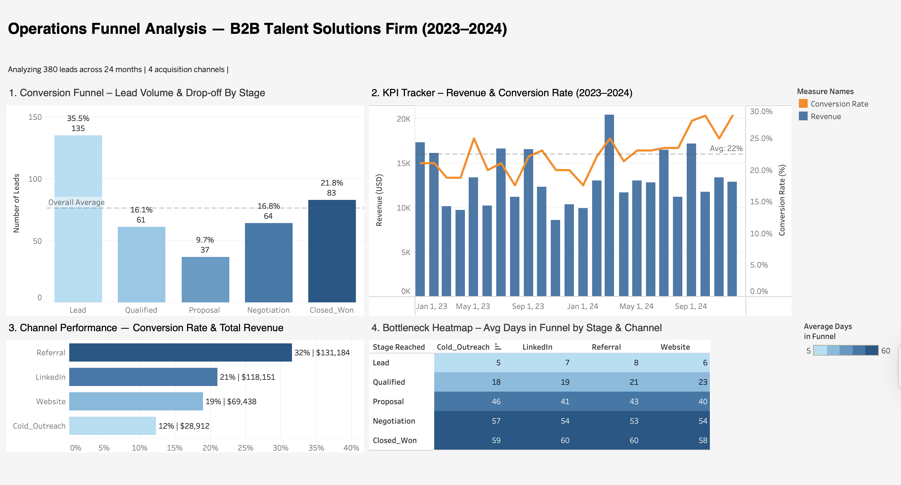

# Operations Funnel Analysis

## Overview
This project simulates the role of an Operations/Jr. Data Analyst hired by a mid-sized B2B Talent Solutions firm to diagnose underperformance in its client acquisition funnel. The firm generates leads across four channels but lacked unified visibility into how those leads move through the pipeline and where potential clients are lost. Using 24 months of synthetic CRM data modeled after real operational dynamics, this analysis delivers a full-funnel diagnostic, a KPI monitoring framework, and actionable recommendations for improving conversion performance.

## Business Questions
- At which stage of the funnel is the highest volume of potential clients lost?
- What are the critical operational KPIs, and how do they evolve over time?
- Which operational levers have the greatest impact on the final conversion rate?

## Dashboard
View interactive dashboard on Tableau Public: https://public.tableau.com/app/profile/cristina.montenegro/viz/DAoperations-funnel-analysis/OperationsFunnelDashboard

## Dataset
- **Source:** Synthetic data generated using Claude AI
- **Size:** 380 leads + 24 months of aggregated KPIs
- **Period:** January 2023 – December 2024
- **Channels:** Referral, LinkedIn, Website, Cold Outreach
- **Service Types:** Contract Staffing, Direct Hire, Consulting
- **Overall conversion rate:** ~22% (calibrated to B2B professional services benchmarks)
- AI prompts used for data generation are documented in   `/ai_prompts/data_generation_prompt.md`

## Methodology
**1. Data Generation**
Synthetic CRM dataset generated using Claude AI with structured prompts calibrated to reflect realistic B2B Talent Solutions firm dynamics. Validated for internal consistency before analysis.

**2. SQL Analysis**
Four core queries written in SQLite via Python to answer the three business questions: stage-by-stage drop-off, channel performance, bottleneck analysis, and monthly KPI tracking.

**3. Exploratory Data Analysis**
Python (Pandas, Matplotlib, Seaborn) used to visualize lead volume trends, conversion by channel, days in funnel distribution, and revenue trend across 24 months.

**4. Cohort Analysis**
Leads grouped by entry month to track conversion performance over time, identify seasonal patterns, and compare deal value across cohorts.

**5. Dashboard**
Interactive Tableau dashboard combining all four analytical views with filters for dynamic exploration by stakeholders.

## Key Findings
**Funnel Drop-off**
- 35.5% of all leads (135) never advanced past the initial Lead stage which is the largest single leak in the funnel
- 16.8% of leads (64) reached Negotiation but did not convert, representing the highest-value loss point given time invested

**Channel Performance**
- Referral is the highest-converting channel at 31.6% with the highest avg deal value ($4,207)
- LinkedIn drives the most total revenue ($118,151) through volume despite a mid-range conversion rate of 21.1%
- Cold Outreach has the lowest conversion rate (12.3%) and lowest avg deal value ($3,686) — lowest ROI by both metrics

**Bottleneck Analysis**
- Negotiation is the most expensive bottleneck. Leads spent 52–57 days before stalling, just 3–7 days short of Closed_Won timelines
- Cold Outreach + Negotiation is the least efficient combination: 57 avg days, zero conversions

**KPI Evolution**
- Conversion rate improved significantly in H2 2024, reaching 28.6% in October–December up from ~20% average in 2023
- Average sales cycle dropped from 62 days (Sep 2023) to 37 days (November 2024), a ~40% efficiency gain

**Cohort Analysis**
- Highest-converting cohorts: May 2023 (43.8%), Jan 2023 (41.7%), Nov 2023 (38.5%), all tied to B2B budget cycle urgency windows
- These seasonal peaks did not repeat at the same intensity in 2024 — a missed opportunity for proactive outreach

## Recommendations
**1. Implement a structured Negotiation intervention protocol**
64 leads stalled at Negotiation after 52–57 days of pipeline investment. A standardized follow-up sequence at the 21-day mark could recover a meaningful share of these near-closes.

**2. Reallocate Cold Outreach resources toward Referral development**
Cold Outreach delivers the lowest conversion rate (12.3%) and lowest deal value ($3,686). Redirecting that effort into a structured referral program could yield significantly higher ROI given Referral's 31.6% conversion rate.

**3. Build a calendar-based outreach strategy**
The firm's best conversion months (Jan, May, Nov) align with B2B budget cycle triggers. A proactive outreach push in the 4 weeks before these windows could systematically capture conversion peaks that currently appear only sporadically.

**4. Prioritize LinkedIn qualification improvement**
LinkedIn generates the most revenue by volume but converts at only 21.1%. Improving qualification criteria at entry could increase conversion without requiring more leads.

## AI & Automation Layer
- **Data generation:** Both datasets generated using Claude AI with structured prompts. Prompts documented in 
  `/ai_prompts/data_generation_prompt.md`
- **GitHub Copilot:** Used for SQL query assistance and Python code suggestions throughout analysis
- **Insight narrative:** Executive summary refined with AI assistance to reflect analytical findings

## Tools Used

`Python` · `Pandas` · `Matplotlib` · `Seaborn` · `SQL` · `SQLite` · `Tableau` · `Excel` · `Claude AI`

## Author
Cristina Montenegro
Data Analyst | HR · Operations · People Analytics |
[LinkedIn](www.linkedin.com/in/cristinamf) | [Portfolio](https://viridian-popcorn-1ee.notion.site/Cristina-Montenegro-Data-Analyst-Portfolio-32bfa0da4ad080cc9589eba84b308dcb)
