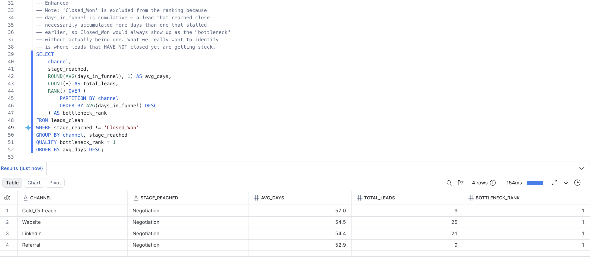
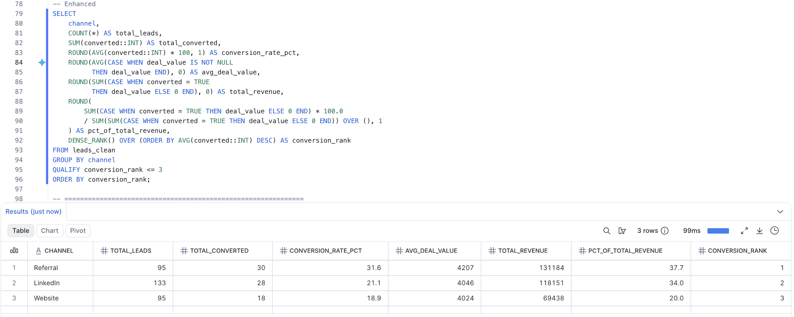
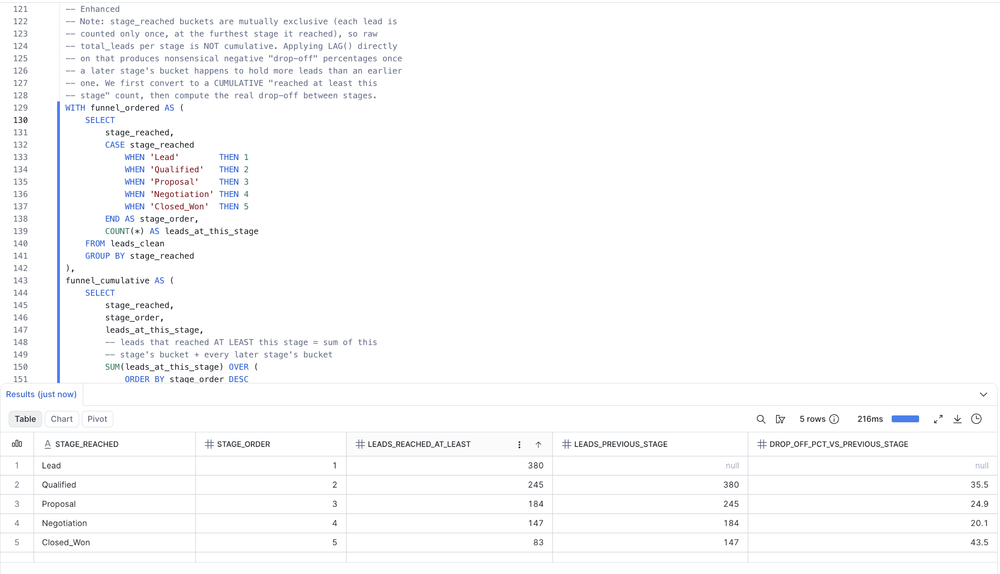
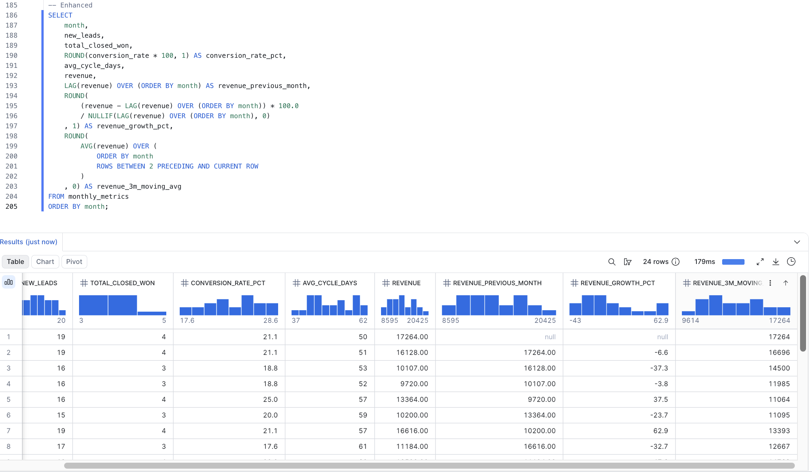

# Snowflake Query Results

This file documents the output of the enhanced queries (`queries_v2.sql`), run in Snowflake using window functions and `QUALIFY`. Screenshots of each query running in Snowsight are in `/snowflake/screenshots`.

---

## 1. Bottleneck Analysis
**Query:** identifies the #1 bottleneck stage per channel using `RANK()` + `QUALIFY`.

**Finding:**
Negotiation is the true bottleneck stage across all four channels, once Closed_Won is excluded from the ranking (days_in_funnel is cumulative, so closed deals always show the highest values without representing a stall). Cold_Outreach shows the highest average (57 days), while Referral shows the lowest (52 days), but the pattern holds consistently across all channels, confirming the original SQLite-based finding.

---

## 2. Channel Performance
**Query:** ranks channels by conversion rate (`DENSE_RANK()`), filtered to Top 3 with `QUALIFY`, plus % contribution to total revenue.

**Finding:**
Referral is both the highest-converting channel (31.6%) and the highest average deal value ($4,207), contributing 37.7% of total revenue despite generating fewer leads than LinkedIn. LinkedIn drives more absolute revenue through volume (133 leads, $118,151 total) but converts at a lower 21.1%. Cold_Outreach falls outside the Top 3 entirely — lowest conversion (12.3%) and lowest deal value ($3,686), confirming it as the weakest-ROI channel.

---

## 3. Funnel Dropoff
**Query:** calculates stage-to-stage drop-off rate using `LAG()`, following the funnel's logical order (Lead → Qualified → Proposal → Negotiation → Closed_Won).

**Finding:**
After correcting the query to use cumulative counts (instead of the mutually-exclusive stage_reached buckets), the highest real drop-off occurs in the Negotiation → Closed_Won transition (43.5%) — even higher than the initial Lead-to-Qualified drop (35.5%). This reinforces the bottleneck analysis finding: Negotiation is the funnel's critical friction point, both in time (longest stall) and in volume of lost deals.

*Note: `stage_reached` represents the furthest stage a lead reached, so this is an approximation of true stage-to-stage attrition, not a strict cumulative funnel count.*

---

## 4. Monthly KPI Tracker
**Query:** adds month-over-month revenue growth (`LAG()`) and a 3-month moving average (`AVG() OVER (ROWS BETWEEN 2 PRECEDING AND CURRENT ROW)`).

**Finding:**
Average sales cycle dropped from 50 days (Jan 2023) to 37 days (Nov 2024), and conversion rate improved to 28.6% in H2 2024 (up from ~20% average in 2023), both consistent with the original SQLite findings. Month-over-month revenue growth (revenue_growth_pct) is highly volatile (ranging from -43.0% to +62.9%), making single-month comparisons unreliable. The 3-month moving average smooths this noise, revealing a consistent upward trend from ~$9,600–11,000 in 2023 to ~$14,000–15,000 by late 2024 — confirming the revenue growth is a sustained trend, not isolated month spikes.

---

## Environment
- **Platform:** Snowflake (30-day trial, Enterprise edition)
- **Warehouse:** `OPS_FUNNEL_WH` (X-Small, auto-suspend 5 min)
- **Database / Schema:** `OPS_FUNNEL_DB.ANALYTICS`
